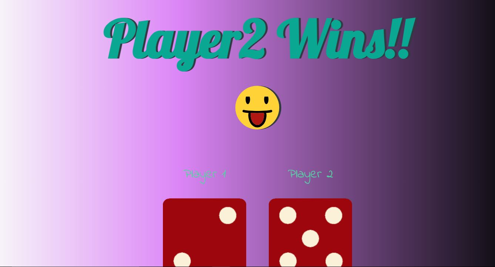

# Dice Challenge Project

This repository contains the Dice Challenge project completed as part of Angela Yu's course. The project is a simple web application built with HTML, CSS, and JavaScript. It simulates a dice game where two players roll dice, and the player with the higher roll wins.

## Project Features

- **HTML**: Provides the structure for the web page.
- **CSS**: Adds styling to create an engaging and visually appealing design.
- **JavaScript**: Implements the game logic, including random dice rolls and determining the winner.

## How to Play

1. Open the `index.html` file in your web browser.
2. Click the "Roll Dice" button to roll the dice for both players.
3. The game will display the dice rolls and announce the winner based on the higher roll.

## Screenshot

  <!-- Add a screenshot if available -->

Feel free to explore the code and enhance the game with additional features!

---

Feel free to adjust the details or add a screenshot if you have one.
